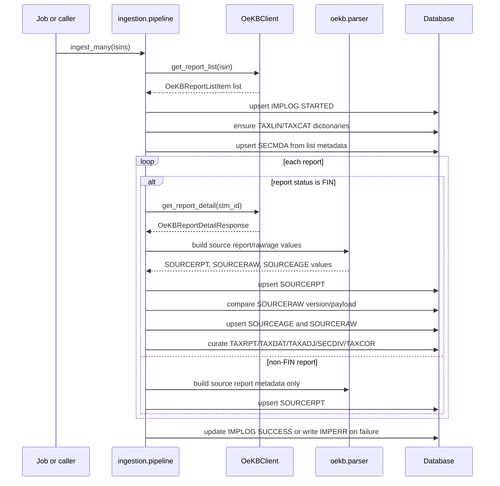
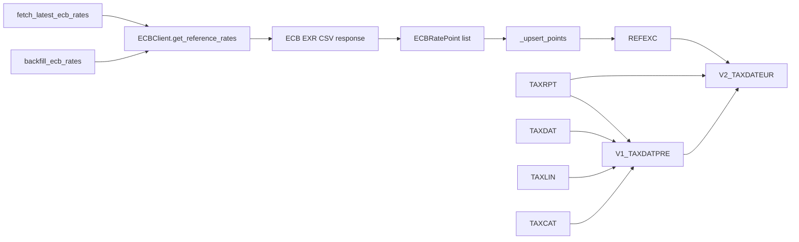
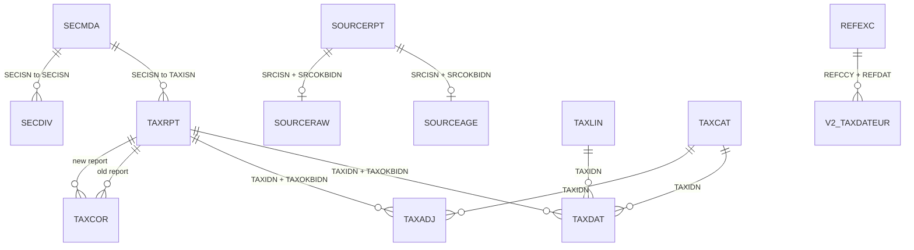

# EV-002 Architecture Relationships And APIs

## Scope

This document maps the current EasyETFsAT implementation across API routes, ingestion, OeKB parsing, ECB FX loading, jobs, database models, migrations, and tests. It is a factual architecture map for validation planning, not a redesign or entropy review.

Source evidence was read from `fondant\api`, `fondant\oekb`, `fondant\ecb`, `fondant\ingestion`, `fondant\jobs`, `fondant\db\models`, `alembic`, `tests`, `docs\db_table_catalog.md`, and `scripts\verify_schema.sql`.

## System Relationship Map

```mermaid
flowchart TD
    Operator[Operator or scheduled runner] --> MissingJob[fetch_missing_isins job]
    Operator --> RefreshJob[refresh_existing_isins job]
    Operator --> FXJob[ECB FX functions]

    MissingJob --> Storage[Documentation/isin_storage.csv]
    MissingJob --> IngestMany[ingest_many]
    RefreshJob --> SourceLookup[SOURCERPT existing ISIN lookup]
    RefreshJob --> IngestMany

    IngestMany --> OeKBClient[OeKBClient]
    OeKBClient --> OeKBList[OeKB steuerMeldung/liste]
    OeKBClient --> OeKBDetail[OeKB steuerMeldung/stmId/.../ertrStBeh]
    OeKBDetail --> Parser[OeKB parser]

    Parser --> SourceTables[SOURCERPT + SOURCEAGE + SOURCERAW]
    SourceTables --> Curator[_curate_report]
    Curator --> Security[SECMDA + SECDIV]
    Curator --> TaxCore[TAXRPT + TAXLIN + TAXCAT + TAXDAT + TAXADJ + TAXCOR]
    IngestMany --> ImportOps[IMPLOG + IMPERR]

    FXJob --> ECBClient[ECBClient]
    ECBClient --> ECBApi[ECB EXR CSV API]
    ECBApi --> RefExc[REFEXC]

    TaxCore --> V1[V1_TAXDATPRE]
    TaxCore --> Api[FastAPI /etf/{isin}/tax]
    RefExc --> V2[V2_TAXDATEUR]
    V1 --> V2

    Api --> Consumer[HTTP consumer]
```

## Ownership Boundaries

| Area | Primary modules | Responsibility |
|---|---|---|
| API surface | `fondant\api\main.py`, `fondant\api\routes\health.py`, `fondant\api\routes\etf.py` | Create the FastAPI app, configure logging, expose health and ETF tax routes, and read curated tax tables. |
| Runtime config | `fondant\config.py` | Provide database URL, OeKB and ECB base URLs, timeout/rate-limit settings, and Alembic URL conversion. |
| Database access | `fondant\db\session.py`, `fondant\db\base.py`, `fondant\db\models\*.py` | Define async SQLAlchemy sessions, declarative base, timestamp/id mixin, and ORM model shape. |
| OeKB integration | `fondant\oekb\client.py`, `fondant\oekb\models.py`, `fondant\oekb\parser.py` | Fetch list/detail report payloads, validate them into Pydantic models, and map OeKB tax payloads into source table values. |
| OeKB ingestion | `fondant\ingestion\pipeline.py` | Orchestrate OeKB ingestion, idempotent upserts, import logging, source persistence, and curated tax table updates. |
| ECB FX ingestion | `fondant\ecb\client.py`, `fondant\ecb\models.py`, `fondant\ingestion\fx_pipeline.py` | Fetch ECB CSV reference rates, parse rate points, and upsert FX observations into `REFEXC`. |
| Jobs | `fondant\jobs\fetch_missing_isins.py`, `fondant\jobs\refresh_existing_isins.py`, `fondant\jobs\isin_storage.py` | Select ISIN candidates, maintain storage CSV inputs, and call `ingest_many`. |
| Schema evolution | `alembic\env.py`, `alembic\versions\*.py` | Build the database schema from ORM metadata and versioned migrations, including source/curated tables and views. |
| Verification | `tests\test_*.py`, `tests\conftest.py`, `scripts\verify_schema.sql` | Test API, clients, parsers, ingestion, jobs, FX, migrations, and schema expectations. |

## Public And Internal Interfaces

| Interface | Type | Inputs | Outputs or handoff | Backing implementation |
|---|---|---|---|---|
| `GET /health` | Public HTTP API | No route parameters. | `{"status": "ok"}`. | `fondant\api\routes\health.py`. |
| `GET /etf/{isin}/tax?year={year}` | Public HTTP API | `isin` path parameter normalized to uppercase; required `year` query constrained to 1900 through 3000. | JSON with `isin`, `year`, `year_fallback_null_used`, `count`, and `reports`. Each report includes OeKB report metadata and nested `tax_fields`. | `fondant\api\routes\etf.py`; reads `TAXRPT`, `TAXDAT`, `TAXLIN`, `TAXCAT`. |
| `OeKBClient.get_report_list` | Internal external-service client | ISIN and optional paging/filter/sort options. | List of `OeKBReportListItem`. | Calls `/steuerMeldung/liste` with OeKB headers and list filters. |
| `OeKBClient.get_report_detail` | Internal external-service client | OeKB `stm_id`. | `OeKBReportDetailResponse` with raw payload. | Calls `/steuerMeldung/stmId/{stm_id}/ertrStBeh`. |
| `build_sourcerpt_values` | Internal parser handoff | ISIN, list report, optional detail. | Metadata dict for `SOURCERPT`. | Extracts year, dates, flags, currency, version, status, and correction ids. |
| `build_sourceage_values` | Internal parser handoff | ISIN, list report, detail. | Wide parsed tax matrix dict for `SOURCEAGE`. | Walks nested payloads using tax field and category maps. |
| `build_sourceraw_values` | Internal parser handoff | ISIN, list report, detail. | Raw payload dict for `SOURCERAW`. | Preserves payload plus version and OeKB id. |
| `ingest_isin` | Internal ingestion service | One ISIN and optional injected OeKB client. | `IngestionResult`; commits source/curated rows or records `IMPERR`. | `fondant\ingestion\pipeline.py`. |
| `ingest_many` | Internal ingestion service | Ordered ISIN list. | List of `IngestionResult`. | Reuses one `OeKBClient` context across ISINs. |
| `backfill_ecb_rates` | Internal FX service | Date range and optional currency list. | `FXIngestionResult`; upserts all returned points. | `fondant\ingestion\fx_pipeline.py`. |
| `fetch_latest_ecb_rates` | Internal FX service | Optional currency list, `as_of`, and lookback days. | `FXIngestionResult`; keeps latest point per currency. | `fondant\ingestion\fx_pipeline.py`. |
| `python -m fondant.jobs.fetch_missing_isins` | Operational CLI job | Storage path, repeated `--isin`, `--persist-input`, `--limit`, `--force`, `--dry-run`, `--show-isins`. | Console summary and process exit code; calls `ingest_many` unless dry-run or no candidates. | Reads `Documentation\isin_storage.csv` and `SOURCERPT`. |
| `python -m fondant.jobs.refresh_existing_isins` | Operational CLI job | Repeated `--isin`, `--limit`, `--dry-run`, `--show-isins`. | Console summary and process exit code; calls `ingest_many` unless dry-run or no candidates. | Reads existing ISINs from `SOURCERPT`. |

## API Route Details

| Route | Inputs | Database reads | Response behavior |
|---|---|---|---|
| `GET /health` | None. | None. | Returns a constant status payload. |
| `GET /etf/{isin}/tax` | Uppercases `isin`; requires `year`. | First queries `TAXRPT` for matching ISIN/year ordered by descending `meldg_datum`. If no rows, queries `TAXRPT` where `report_year IS NULL`. Then loads matching `TAXDAT` joined to `TAXLIN` and `TAXCAT`. | Returns `404` if neither exact year nor null-year fallback exists. Otherwise groups tax amounts under `tax_fields[metric_key][category_key]`, includes OeKB report identifiers/status/currency/date, and flags whether null-year fallback was used. |

The API currently reads curated tax tables directly. It does not call OeKB, ECB, ingestion jobs, or database views at request time.

## OeKB Data Flow



Key handoff points:

| Handoff | Source | Target | Notes |
|---|---|---|---|
| OeKB list payload to `OeKBReportListItem` | `OeKBClient.get_report_list` | Pydantic model list | List payload extraction accepts direct lists or common wrapped list keys. |
| OeKB detail payload to parser | `OeKBClient.get_report_detail` | `build_sourcerpt_values`, `build_sourceraw_values`, `build_sourceage_values` | Detail payload is preserved in `SOURCERAW` and parsed into source metadata/tax values. |
| Source metadata | parser | `SOURCERPT` | One row per `SRCISN + SRCOKBIDN`; includes version/status/year/date/currency/report flags. |
| Parsed wide tax matrix | parser | `SOURCEAGE` | One row per `SRCISN + SRCOKBIDN`; wide K-code/category columns. |
| Raw payload | parser | `SOURCERAW` | One row per `SRCISN + SRCOKBIDN`; JSON/JSONB payload. |
| Source to curated report | `_curate_report` | `TAXRPT` | Copies report metadata into curated layer. |
| Source wide values to narrow curated points | `_curate_report` | `TAXDAT` through `TAXLIN` and `TAXCAT` | Metric/category maps from parser dictionaries drive line/category lookup. |
| K61 adjustment values | `_curate_report` | `TAXADJ` | Emits adjustment rows with `adj_code = AKC` for K61 values. |
| Distribution events | `_curate_report` | `SECDIV` | Emits `DIST` event when source report is a distribution and has `zufluss`. |
| Correction ids | `_curate_report` | `TAXCOR` | Links old and new `TAXRPT` rows when a corrected OeKB id is present. |
| Import observability | `ingest_isin` | `IMPLOG`, `IMPERR` | Logs started/success/failed run state and errors. |

## ECB FX Data Flow And View Dependency



`ECBClient` builds an ECB EXR key like `D.CHF+USD.EUR.SP00.A`, requests CSV with `startPeriod`, `endPeriod`, and `format=csvdata`, and parses rows into `ECBRatePoint(rate_date, currency_code, rate)`. The FX pipeline upserts those points into `REFEXC` on `(REFDAT, REFCCY)`.

`V1_TAXDATPRE` is a tax projection view over `TAXRPT`, `TAXDAT`, `TAXLIN`, and `TAXCAT`. `V2_TAXDATEUR` depends on `V1_TAXDATPRE`, joins `TAXRPT` for `TAXMDT`, joins `REFEXC` where `REFCCY = FNDCCY` and `REFDAT = TAXMDT`, treats EUR as rate `1`, and divides selected tax values by the FX rate. This means non-EUR EUR-converted view values depend on an exact same-date `REFEXC` row.

## Database Relationship Map



| Table or view | Role in architecture | Grain or key relationship |
|---|---|---|
| `SECMDA` | Security master populated during OeKB ingestion. | One row per `SECISN`; referenced by `TAXRPT` and `SECDIV`. |
| `SECDIV` | Distribution/cash-flow events derived from curated source reports. | Unique `SECISN + SECFLWDAT + SECFLWTYP + SECOKBIDN`. |
| `SOURCERPT` | Source-faithful OeKB report metadata, including non-FIN reports. | Unique `SRCISN + SRCOKBIDN`. |
| `SOURCEAGE` | Source-faithful wide parsed tax matrix for FIN reports. | Unique `SRCISN + SRCOKBIDN`; FK to `SOURCERPT`. |
| `SOURCERAW` | Raw OeKB detail payload for FIN reports. | Unique `SRCISN + SRCOKBIDN`; FK to `SOURCERPT`. |
| `TAXRPT` | Curated tax report event used by API and views. | Unique `TAXISN + TAXOKBIDN`; FK to `SECMDA`. |
| `TAXLIN` | Tax metric dictionary, populated by ingestion. | Unique `TAXCOD` and `TAXKEY`. |
| `TAXCAT` | Investor category dictionary, populated by ingestion. | Unique `TAXCOD` and `TAXKEY`. |
| `TAXDAT` | Curated narrow tax values used by API and views. | Unique `TAXRPTIDN + TAXLINIDN + TAXCATIDN`; FKs to `TAXRPT`, `TAXLIN`, `TAXCAT`. |
| `TAXADJ` | Cost-basis adjustment projection for K61 values. | Unique `TAXRPTIDN + TAXCATIDN + TAXCOD`; FKs to `TAXRPT`, `TAXCAT`. |
| `TAXCOR` | Correction-chain links between curated reports. | Unique old/new tax report pair. |
| `REFEXC` | ECB reference rates for FX conversion. | Unique `REFDAT + REFCCY`. |
| `IMPLOG`, `IMPERR` | Ingestion run and error observability. | Run-level records keyed by generated run id and row id. |
| `V1_TAXDATPRE` | Pre-aggregated tax projection by report event. | Groups by `TAXISN`, `TAXOKBIDN`, `TAXYEA`, `FNDCCY`. |
| `V2_TAXDATEUR` | EUR-converted tax projection. | Depends on `V1_TAXDATPRE`, `TAXRPT`, and `REFEXC`. |

## Migration Chain

Alembic is configured in `alembic\env.py` to use `Settings.alembic_database_url` and `Base.metadata`. The migration chain observed by source and tests runs from `20260418_0001` to `20260419_0011`.

| Migration area | Evidence | Architectural effect |
|---|---|---|
| Initial and early tax shape | `20260418_0001` through `20260418_0005` | Establishes earlier schema stages before the source/curated rebuild. |
| Source plus curated rebuild | `20260419_0006_rebuild_source_curated_architecture.py` | Drops obsolete tax shape, creates `SOURCERPT`, `SOURCEAGE`, `SOURCERAW`, curated `TAX*` tables, `SECMDA`, and `SECDIV`. |
| Projection view | `20260419_0007_add_v1_taxdatpre_view.py` | Adds `V1_TAXDATPRE`. |
| FX table and view extension | `20260419_0008_add_refexc_and_extend_v1_taxdatpre.py` | Adds `REFEXC` and extends view behavior for FX-dependent projection. |
| Legal entity/category refinements | `20260419_0009`, `20260419_0010` | Extends tax projection fields, including K40/K62 coverage. |
| Final view refinement | `20260419_0011_refine_v1_and_add_v2_taxdateur.py` | Rebuilds `V1_TAXDATPRE` and adds `V2_TAXDATEUR`, which depends on `REFEXC`. |

`tests\test_migrations.py` asserts the fresh install reaches revision `20260419_0011`, includes expected source/curated/reference/import tables, excludes obsolete `TAXAGE`, `TAXRAW`, and `TAXLST`, and exposes `V1_TAXDATPRE` and `V2_TAXDATEUR`.

## Job Flows

| Job | Selection source | Main database reads | Main handoff | Dry-run behavior |
|---|---|---|---|---|
| `fetch_missing_isins` | `Documentation\isin_storage.csv` plus optional repeated `--isin`. Optional `--persist-input` writes new ISINs to the selected storage path. | Reads distinct `SOURCERPT.isin` unless `--force` bypasses missing-only selection. | Calls `ingest_many(candidates)`. | Prints universe, existing count, candidate count, and optional ISIN list; exits before ingestion. |
| `refresh_existing_isins` | Existing distinct ISINs in `SOURCERPT`, optionally filtered by repeated `--isin`. | Reads distinct `SOURCERPT.isin`. | Calls `ingest_many(candidates)`. | Prints existing count, candidate count, missing requested ISINs, and optional ISIN list; exits before ingestion. |
| FX functions | Caller-provided dates/currencies or defaults. | No pre-read; writes `REFEXC`. | Calls `ECBClient.get_reference_rates` then `_upsert_points`. | No CLI dry-run in current implementation. |

## Test Coverage Map

| Test file | Covered behavior | Main source areas exercised |
|---|---|---|
| `tests\test_api_etf.py` | `/etf/{isin}/tax` successful response, 404 for missing year, null-year fallback. | `fondant\api\main.py`, `fondant\api\routes\etf.py`, `TAXRPT`, `TAXDAT`, `TAXLIN`, `TAXCAT`. |
| `tests\test_oekb_client.py` | OeKB list/detail request URLs, headers, query parameters, and response model parsing. | `fondant\oekb\client.py`, `fondant\config.py`. |
| `tests\test_oekb_parser.py` | Mapping selected OeKB tax names/category suffixes into parser output, including `bvJurPerson4`, `stiftung4`, K40, and K62. | `fondant\oekb\parser.py`, `fondant\oekb\models.py`. |
| `tests\test_ingestion.py` | OeKB ingestion idempotency, same-version changed-payload update, dictionary seeding, source tables, curated tables, and import logs. | `fondant\ingestion\pipeline.py`, source models, tax models, `SECMDA`, `IMPLOG`. |
| `tests\test_ecb_client.py` | ECB CSV route shape, query parameters, sorted currency key, and CSV parsing into rate points. | `fondant\ecb\client.py`, `fondant\ecb\models.py`, `fondant\config.py`. |
| `tests\test_fx_pipeline.py` | ECB backfill upserts and latest-per-currency selection. | `fondant\ingestion\fx_pipeline.py`, `REFEXC`. |
| `tests\test_jobs_isin_workflows.py` | Missing-ISIN dry-run selection, persisted storage input, and refresh filtering for requested existing ISINs. | `fondant\jobs\fetch_missing_isins.py`, `fondant\jobs\refresh_existing_isins.py`, `fondant\jobs\isin_storage.py`, `SOURCERPT`. |
| `tests\test_migrations.py` | Fresh migration install for SQLite and Docker-backed PostgreSQL when available; table/view/revision assertions. | `alembic\versions`, `alembic\env.py`, schema tables and views. |
| `tests\conftest.py` | Settings cache reset around tests. | `fondant\config.py`. |

## Source Evidence Index

- API: `fondant\api\main.py`, `fondant\api\routes\health.py`, `fondant\api\routes\etf.py`.
- Config/session/base: `fondant\config.py`, `fondant\db\session.py`, `fondant\db\base.py`.
- Models: `fondant\db\models\sec.py`, `fondant\db\models\tax.py`, `fondant\db\models\ref.py`, `fondant\db\models\imp.py`, `fondant\db\models\__init__.py`.
- OeKB: `fondant\oekb\client.py`, `fondant\oekb\models.py`, `fondant\oekb\parser.py`.
- ECB: `fondant\ecb\client.py`, `fondant\ecb\models.py`, `fondant\ingestion\fx_pipeline.py`.
- Ingestion/jobs: `fondant\ingestion\pipeline.py`, `fondant\ingestion\seed.py`, `fondant\jobs\fetch_missing_isins.py`, `fondant\jobs\refresh_existing_isins.py`, `fondant\jobs\isin_storage.py`.
- Migrations/schema docs: `alembic\env.py`, `alembic\versions\*.py`, `docs\db_table_catalog.md`, `scripts\verify_schema.sql`.
- Tests: `tests\test_api_etf.py`, `tests\test_oekb_client.py`, `tests\test_oekb_parser.py`, `tests\test_ingestion.py`, `tests\test_ecb_client.py`, `tests\test_fx_pipeline.py`, `tests\test_jobs_isin_workflows.py`, `tests\test_migrations.py`, `tests\conftest.py`.

## Manual Verification Required

Per EV-002, a human should review this architecture map for readability and source fidelity before the ticket is accepted.
